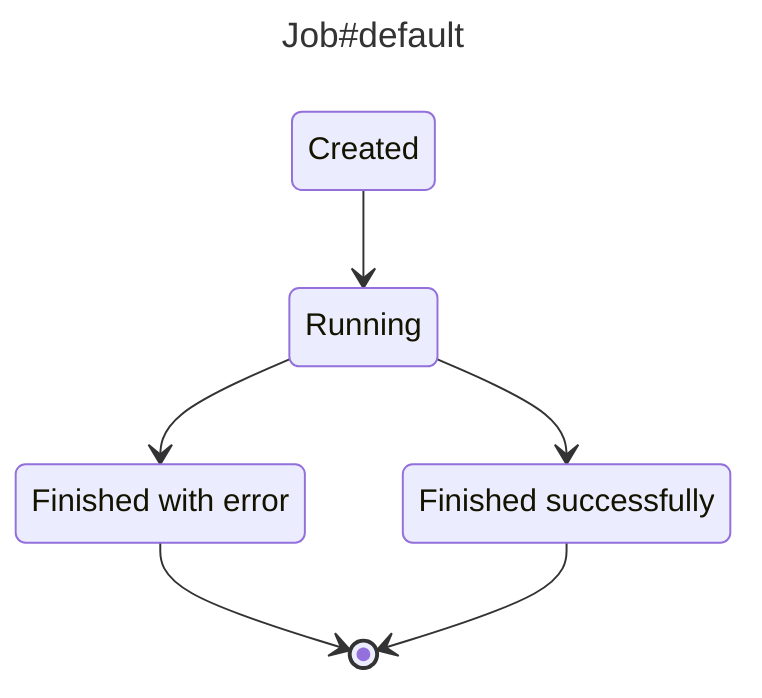

# `aasm-vis`

`aasm-vis` generates a visual representation of the state machines defined with `aasm` gem.

## Installation

Add `gem 'aasm-vis', group: :development` to your `Gemfile` and run `bundle`.

## Usage

`bundle exec rake aasm_vis:generate`

To visualise the results you can use the [github cli](https://cli.github.com/): `gh gist create tmp/assm-vis.md` or any other tool that can render markdown files supporting mermaid.


## Example

The following ruby code defines a simple state machine for a `Job` model:
```ruby
  class Job < ApplicationRecord
    include AASM

    aasm do
      state :created, initial: true
      state :running
      state :finished_successfully
      state :finished_with_error

      event :run, after: :notify_somebody do
        transitions from: :created, to: :running
        transitions from: :running, to: :finished_with_error
        transitions from: :running, to: :finished_successfully
      end
    end
```

It will generate the following mermaid diagram:



## Development

After checking out the repo, run `bin/setup` to install dependencies. Then, run `rake spec` to run the tests. You can also run `bin/console` for an interactive prompt that will allow you to experiment.

To install this gem onto your local machine, run `bundle exec rake install`. To release a new version, update the version number in `version.rb`, and then run `bundle exec rake release`, which will create a git tag for the version, push git commits and the created tag, and push the `.gem` file to [rubygems.org](https://rubygems.org).

## Contributing

Bug reports and pull requests are welcome on GitHub at https://github.com/kamil-gwozdz/aasm-vis. This project is intended to be a safe, welcoming space for collaboration, and contributors are expected to adhere to the [code of conduct](https://github.com/[USERNAME]/aasm-vis/blob/main/CODE_OF_CONDUCT.md).

## License

The gem is available as open source under the terms of the [MIT License](https://opensource.org/licenses/MIT).

## Code of Conduct

Everyone interacting in the AASM::Vis project's codebases, issue trackers, chat rooms and mailing lists is expected to follow the [code of conduct](https://github.com/[USERNAME]/aasm-vis/blob/main/CODE_OF_CONDUCT.md).
